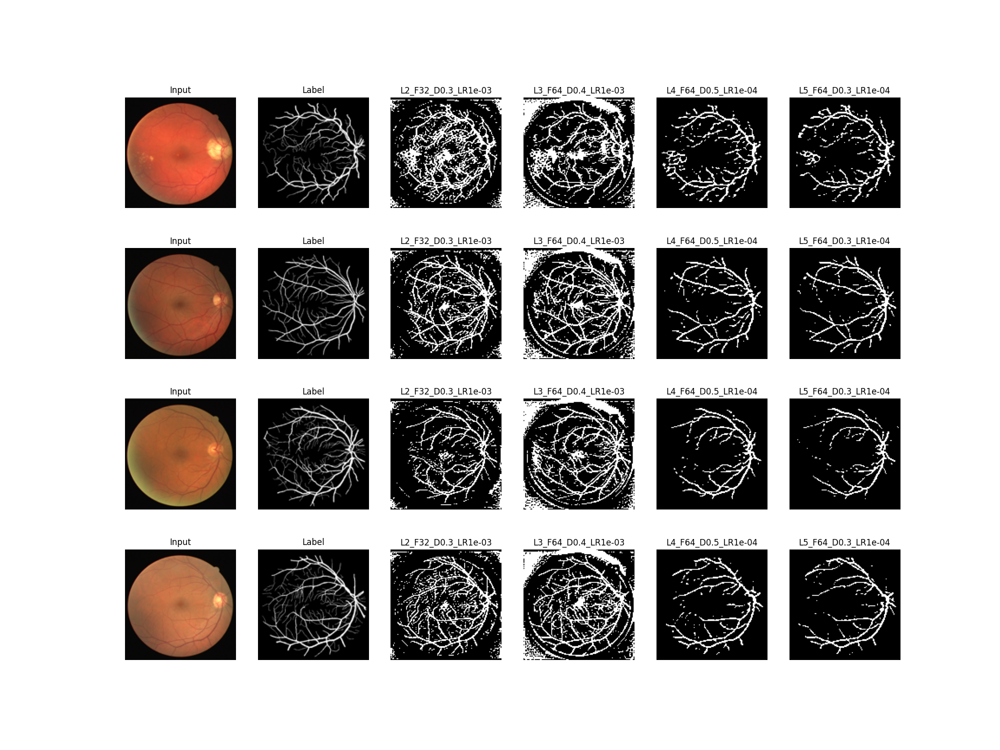
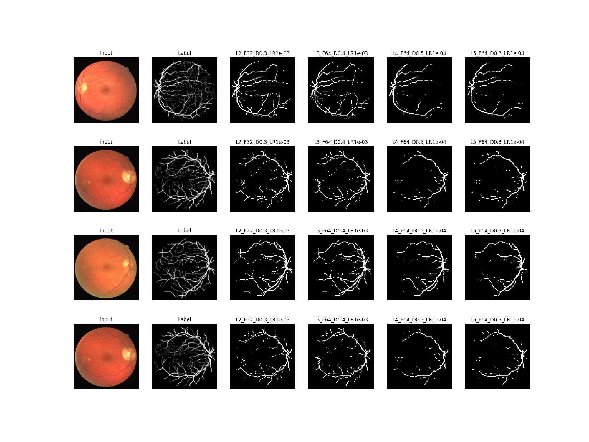

# **Retina Blood Vessel Segmentation with U-Net**

### **Student:** Adonai Vera  
### **Course:** CS 5173/6073: Deep Learning  
### **Instructor:** Dr. Jun Bai  

---

## **Project Overview**

This project involves segmenting blood vessels in retinal fundus images using various U-Net architectures. Different configurations of U-Net models were trained and evaluated to optimize Dice and IoU scores, essential metrics for medical image segmentation tasks.




---

## **Dataset**

The dataset used for this project is a Retina Blood Vessel Segmentation dataset, containing high-resolution retinal images annotated for blood vessel segmentation. This dataset is instrumental in advancing ophthalmology and aiding in the early detection of retinal diseases.

---

## **Project Steps**

1. **Data Analysis**:
   - Analyzed the dataset to understand its structure, dimensions, and potential preprocessing needs.
   - Key insights, such as sample count and label distribution, were noted.

2. **Data Preprocessing**:
   - Converted the annotations to binary masks (vessel pixels as 1 and background as 0).
   - Normalized pixel values for consistency and reshaped images for compatibility with the U-Net input layers.
   - Split the dataset into training, validation, and test sets.

3. **Model Configurations**:
   - Implemented U-Net models with varying depths and filter sizes. The configurations are:
     - **2 Layers**: `base_filters=32`, `dropout_rate=0.3`, `learning_rate=1e-3`
     - **3 Layers**: `base_filters=64`, `dropout_rate=0.4`, `learning_rate=1e-3`
     - **4 Layers**: `base_filters=64`, `dropout_rate=0.5`, `learning_rate=1e-4`
     - **5 Layers**: `base_filters=64`, `dropout_rate=0.3`, `learning_rate=1e-4`
   - The models were optimized for Dice coefficient and IoU score.

4. **Training and Evaluation**:
   - Each model configuration was trained with early stopping and learning rate reduction to avoid overfitting.
   - The trained models were evaluated on the test set using Dice and IoU metrics.

5. **Results and Visualizations**:
   - Dice and IoU metrics were calculated for both normalized and unnormalized predictions.
   - Model performance was visualized, showing input images, ground truth labels, and predictions for each configuration.

---

## **Setup Instructions**

### **Prerequisites**

- Python 3.8 or higher.
- Required libraries are listed in `requirements.txt`.

### **Installing Dependencies**

To install all necessary packages, run:

```bash
pip install -r requirements.txt
```

### **Running the Project**

To train the U-Net models with various configurations, execute:

```bash
python main.py
```

This script will:
- Load and preprocess the dataset.
- Train multiple U-Net configurations.
- Save the best model weights and generate training history plots.

---

## **Testing Models**

To test the trained models and generate predictions, run:

```bash
python test_model.py
```

This script will:
- Load each U-Net model configuration from the `weights` directory.
- Generate predictions on the test dataset.
- Save visualizations comparing ground truth and predictions in the `figures` directory.

---

## **Project Structure**

```
├── data/
│   ├── Data/                        # Dataset directory containing train and test images and masks
│   ├── test/                        # Test set images and masks
│       ├── image/
│       └── mask/
├── figures/                         # Saved figures for model comparisons and performance plots
├── methods/
│   ├── preprocessing.py             # Preprocessing script for data normalization and augmentation
│   ├── dataset_analysis.py          # EDA scripts (if any)
├── models/
│   ├── unet_trainer.py              # U-Net model architecture and training class
│   ├── weights/                     # Directory for saved model weights
├── main.py                          # Main script to train U-Net models
├── test_model.py                    # Script to test models and generate visualizations
├── requirements.txt                 # Required libraries for the project
├── README.md                        # Project description and instructions
```

---

## **Model Performance**

### **Dice and IoU Scores**

| Model Configuration                | Dice (Normalized) | IoU (Normalized) | Dice (Unnormalized) | IoU (Unnormalized) |
|------------------------------------|-------------------|------------------|----------------------|---------------------|
| U-Net 2 layers, filters=32, lr=1e-3 | 0.7013           | 0.5400          | 0.5260              | 0.3568             |
| U-Net 3 layers, filters=64, lr=1e-3 | 0.6986           | 0.5369          | 0.3918              | 0.2436             |
| U-Net 4 layers, filters=64, lr=1e-4 | 0.5145           | 0.3464          | 0.7336              | 0.5793             |
| U-Net 5 layers, filters=64, lr=1e-4 | 0.5654           | 0.3941          | 0.7620              | 0.6155             |

---

## **Conclusion**

The U-Net with **5 layers, base filters of 64, dropout rate of 0.3, and learning rate of 1e-4** achieved the best performance in unnormalized Dice and IoU metrics, making it the most suitable model for this segmentation task. This architecture effectively captures vessel structures, providing better generalization and robustness for retinal image segmentation.